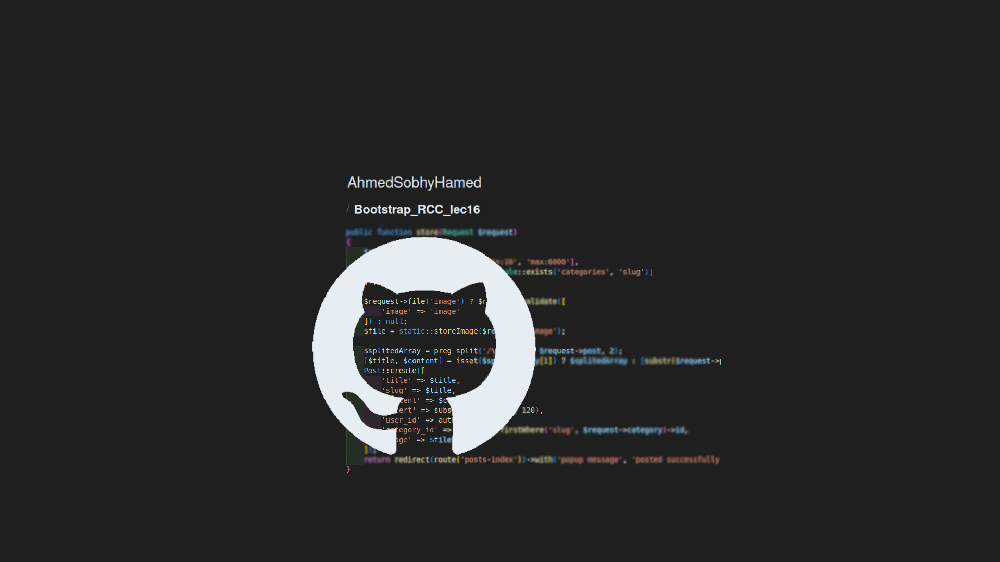

# Bootstrap_ACC_Project

A small Bootstrap-based project using HTML, CSS, and Bootstrap to practice during an RCC course.


## Table of Contents

- [Introduction](#introduction)
- [Features](#features)
- [Usage](#usage)
- [Technologies Used](#technologies-used)
- [Project Structure](#project-structure)
- [License](#license)
- [Contact](#contact)

  <!-- intro -->

## Introduction

This project is a Bootstrap practice section during a PHP full-stack RCC diploma.

  <!-- technologies was used with links if available -->

## Features

- Using bootstrap 5.
- Using font awesome 6.
- Use the Bootstrap navbar component.
  <br>
  Example:

  ```html
  <nav
    class="navbar navbar-expand-lg py-0 border-bottom fixed-top w-100  bg-dark "
    data-bs-theme="dark"
  >
    <div class="container">
      <a class="navbar-brand" href="#">
        
      </a>
      <button
        class="navbar-toggler"
        type="button"
        data-bs-toggle="collapse"
        data-bs-target="#navbarSupportedContent"
      >
        <span class="navbar-toggler-icon"></span>
      </button>
      <div class="collapse navbar-collapse" id="navbarSupportedContent">
        <ul class="navbar-nav mx-auto mb-2 mb-lg-0 text-uppercase fw-bold">
          <li class="nav-item">
            <a class="nav-link active" aria-current="page" href="#">Home</a>
          </li>
          ...
        </ul>
        <div class=" border p-3 border-bottom-0">
          <i class="fa-solid fa-magnifying-glass"></i>
        </div>
      </div>
    </div>
  </nav>
  ```

- Use the Bootstrap carousel component.
  <br>
  Example:

  ```html
  <div id="carouselExampleCaptions" class="carousel slide">
    <div class="carousel-indicators">
      <button
        type="button"
        data-bs-target="#carouselExampleCaptions"
        data-bs-slide-to="0"
        class="active"
      ></button>
    </div>
    <div class="carousel-inner">
      <div class="carousel-item active">
        
        <div class="carousel-caption d-none d-md-block bottom-50 text-start">
          <h5>Hello , I'm Chadwick Boseman</h5>
        </div>
      </div>
    </div>
    <button
      class="carousel-control-prev"
      type="button"
      data-bs-target="#carouselExampleCaptions"
      data-bs-slide="prev"
    >
      <span class="carousel-control-prev-icon"></span>
    </button>
    <button
      class="carousel-control-next"
      type="button"
      data-bs-target="#carouselExampleCaptions"
      data-bs-slide="next"
    >
      <span class="carousel-control-next-icon"></span>
    </button>
  </div>
  ```

- Use the Bootstrap grid system.
  <br>
  Example:

  ```html
  <section class="services">
    <div class="container py-5">
      <h5 class="fw-normal btn btn-outline-light rounded-pill text-uppercase">
        futuere & services
      </h5>
      <div class="row mb-5">
        <div class="col-6">
          <h2 class=" fs-1 text-capitalize">our services</h2>
        </div>
        <div class="col-6 d-flex justify-content-end">
          <a
            class="link-underline-opacity-0 link-light icon-link icon-link-hover link-underline-opacity-50-hover"
            href=""
            >View All Services <i class="fa-solid fa-right-long"></i
          ></a>
        </div>
      </div>
    </div>
  </section>
  ```

    <!-- usage or how to interact with this technologies like api end points and what they do -->

## Usage

**You can interact with the project via this link**
[web page on github](https://ahmedsobhyhamed.github.io/Bootstrap_RCC_Project/).
<br>
**[see an example for user interaction.[video]](https://youtube.com)**
<br>
**[demonstration video for developer communit](https://www.youtube.com)**

## Technologies Used

- HTML 5.
- CSS.
- Bootstrap 5.

  <!-- about the project and a digram of how it work -->

## Project Structure

- Project page:
  - index.html
    <!-- licance -->

## License

This project is licensed under the MIT License - see the [LICENSE](/LICENSE) file for details

  <!-- contacts -->

## Contact

Created by [Ahmed Sobhy]:

- email: [ahmed.s.abdulaal@gmail.com](mailto:ahmed.s.abdulaal@gmail.com)
- linkedin: [Ahmed Sobhy](https://www.linkedin.com/in/ahmed-sobhy-b824b7201/)
  <br>
  feel free to contact me!
